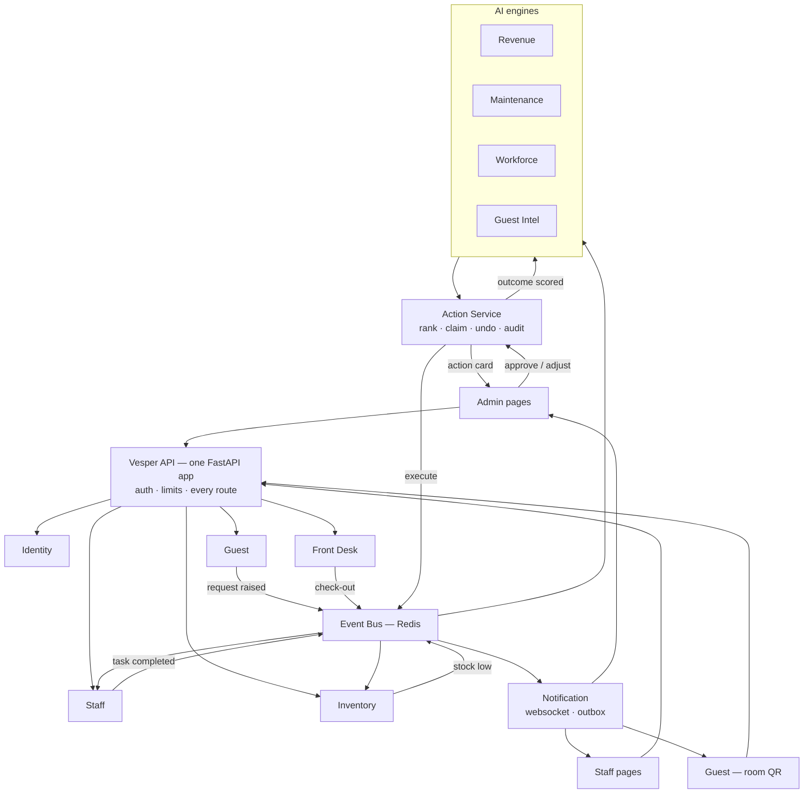

# Vesper

**Smart Resort 360 — one operating layer for a large hotel.**

Vesper connects the three people who never share a screen: the **guest** in the room,
the **staff member** on the floor, and the **owner** in the office. A guest scans the QR
code on their nightstand, a housekeeper's phone buzzes, stock drops by one, the AI
notices bread is running low, and the owner approves a purchase order — one flow, no
phone calls in between.

Demo property: **JW Marriott Mumbai, Juhu.**

> **Disclaimer** — Vesper is an academic project. It is not affiliated with, endorsed by,
> or connected to Marriott International or any of its properties. Every guest, booking,
> staff member, sensor reading, invoice and revenue figure in this repository is
> simulated demo data.

**Stack:** Next.js 15 · React 19 · TypeScript · FastAPI · PostgreSQL · Redis · Docker
**AI:** Prophet · XGBoost · LightGBM · Isolation Forest · OR-Tools CP-SAT · Sentence-BERT · FAISS · Claude

---

## 1. What Vesper does

| For | They open | They can |
|---|---|---|
| **Guest** | Room QR link — no login | Order room service, request cleaning or towels, report a problem, track status live, rate in one tap, ask the AI concierge |
| **Staff** | Vesper on their phone browser | Mark attendance and work assigned tasks; departmental operations require explicit grants |
| **Manager** | Vesper on desktop | Manage assigned departments within assigned branches |
| **General Manager** | Management dashboard | Administer accounts and view cross-department operations and AI analytics |

Internal accounts use exactly these three roles. Branch and department assignments are stored separately from roles. Guest QR access is stay-scoped and separate from internal accounts.

The spine of the product is the **action card**: the AI recommends, a human decides, the
system executes, and the outcome is scored back against the engine that suggested it.

---

## 2. System flow

How one guest request travels through the whole system.



### The same flow in words

1. A guest scans the QR on the nightstand of **Room 412**. The token is valid only while
   that room is occupied — no login needed, and nobody outside the hotel can use it.
2. They order two club sandwiches. **Guest service** creates the request and publishes an
   event.
3. **Staff** turns it into a task, routes it to F&B and starts an SLA timer. The
   kitchen's phone buzzes within seconds.
4. The waiter marks it delivered. **Inventory** hears the same event and deducts
   the ingredients automatically.
5. Bread crosses its minimum. **Inventory** raises a purchase suggestion, which the
   **action queue** ranks by confidence × impact × urgency and puts in the owner's
   queue.
6. The owner approves it. The action queue executes, logs it to the audit trail, and gives
   them a 10-minute undo window.
7. A week later the outcome is scored back — if the suggestion was good, that engine's
   confidence goes up. Vesper gets better at its own job.
8. Meanwhile the guest saw *Delivered* on their phone and tapped four stars.

Nobody made a phone call.

---

## 3. Architecture

One FastAPI application, twelve bounded contexts inside it. Each context owns its own
tables and its own schema, and never reads another's — it calls that context's routes,
or hears about the change asynchronously over the event bus.

### Operations

| Module | Owns | Responsibilities |
|---|---|---|
| `identity` | users, roles | Login, tokens, permission matrix (`rates:approve`, `attendance:mark`, …) |
| `property` | property, departments, rooms, assets | Resort profile, room categories, CSV import with dry-run, PMS/BMS connectors |
| `staff` | attendance, tasks | Shift check-in/out, task routing, housekeeping room board, live updates |
| `guest` | guests, QR, requests | Room QR tokens, service requests, issue reports with photos, ratings |
| `inventory` | stock, purchase orders | Stock in/out, minimums, expiry, auto-deduction, reorder triggers |
| `frontdesk` | bookings, stays | Check-in/out, room allocation, guest visit history |

### Intelligence

| Module | Owns | Responsibilities |
|---|---|---|
| `action` | action cards, audit log | Card ranking, claim lock, approve / adjust / snooze / dismiss, safe undo, shadow mode, feedback loop and learning |
| `revenue` | forecasts, rates | Demand forecasting (Prophet + XGBoost + LightGBM), per-date rate execution, competitor set, what-if simulator |
| `maintenance` | asset health, work orders | Anomaly detection on BMS sensors, survival-based risk scores, service windows, work orders |
| `workforce` | rosters | OR-Tools CP-SAT auto-roster from attendance and demand, staffing-gap warnings, leave and shift rules |
| `guest_intel` | guest DNA, concierge | Sentiment model, preference profiles, at-risk retention offers, RAG concierge (Sentence-BERT + FAISS + Claude) |
| `notification` | outbox | WebSocket fan-out, overdue alerts, retrying outbox for mock WhatsApp / SMS / email |

**Why one process:** this was thirteen deployable services behind a gateway, and for one
property that bought isolation nobody was using and charged for it every day — thirteen
images to build, a proxy hop on every request, and a bug reproducible only by running
the whole stack. The boundaries were the valuable part and they are all still here: a
context's tables are still its own, the contexts still talk through each other's routes
rather than each other's tables, and the event bus still carries every cross-context
fact. What went away is the deployment cost of pretending they are far apart.

**What that costs, honestly:** a crash no longer stops at one container, and a slow
engine shares a process with the guest ordering dinner. Both are bounded rather than
ignored — every scheduled job and every bus handler catches its own exceptions, the
engines' heavy work runs on scheduler threads rather than in the request path, and the
worker pool is sized for handlers that call each other. If one context genuinely
outgrows this, `app/api/<name>/` is a package with its own routers, models and jobs; the
path back out is to give it its own `main.py` again.

---

## 4. Repository layout

```
├── apps/
│   ├── web/              The whole product — one Next.js app
│   │   └── app/
│   │       ├── (admin)/  Owner and manager screens
│   │       ├── (staff)/  Attendance, tasks, requests — phone-first
│   │       ├── (guest)/  Public QR pages, no login
│   │       └── (auth)/   Login
│   └── marketing-site/   Backlog — after the demo works
│
├── app/                  The backend — one FastAPI application
│   ├── main.py           Entry point: mounts every router, starts the workers
│   ├── dependencies.py   DB session, auth, permissions — one import for handlers
│   ├── transport.py      Internal calls, dispatched in-process instead of over TCP
│   ├── rate_limit.py     Per-principal limits, at the edge of the one process
│   ├── api/              One package per bounded context (below)
│   ├── background/       Event consumers and the scheduled jobs
│   └── schemas/          Every request/response model, in one namespace
│
├── packages/
│   ├── contracts/        OpenAPI specs + event schemas, shared both sides
│   ├── ui-kit/           Shared components and the Vesper theme
│   └── py-common/        Shared Python: auth, db session, event bus client
│
├── infra/
│   ├── migrations/       Alembic — one schema, one dev database
│   └── postgres/
│
├── data/seed/            JW Marriott Mumbai demo data
├── docs/
├── scripts/              Seeding, day simulator, contract export
├── tests/                One directory per context, plus the app's own smoke tests
├── Dockerfile            One image for the whole backend
├── docker-compose.yml
└── Makefile
```

One Next.js app, not three. Staff and guests open the same site their manager does —
they just land in a different route group with its own layout, phone-first. That means
one deploy, one domain and one session cookie instead of three builds and cross-origin
auth. Making the staff section installable, or a native app, is a later decision that
this structure doesn't block.

Every context is the same handful of modules, so moving between them is muscle memory:

```
app/api/<name>/
├── __init__.py     what the app mounts and starts: routers, subscriptions, jobs
├── router.py       HTTP routes, carrying their own prefix (/rooms, /inventory, …)
├── models.py       SQLAlchemy tables, in this context's schema
├── schemas.py      Pydantic request/response
├── service.py      business logic
├── events.py       publishers and subscribers
├── jobs.py         periodic work (the contexts that have any)
└── engines/        ML and optimisation (the intelligence contexts only)
```

Flat modules, not nested packages — a context owns one job, and a folder per layer would
be five empty directories pretending to be architecture. Split a module into a package
on the day it earns it, as `guest_intel` has with `rag/` for the concierge's embeddings
and vector store.

That `__init__.py` is the whole contract between a context and the application. It
exports `routers`, and optionally `start_subscriptions` and `build_scheduler`;
`app/main.py` and `app/background/` look for exactly those names and nothing else, so
adding a context is adding a directory. `tests/test_wiring.py` fails the build if one
declares jobs it never exports — the quiet failure that costs you a scheduler.

The database is unchanged from the service era: one PostgreSQL database with one schema
per context, which keeps the demo runnable on a laptop. A context reads only its own
schema, so splitting the databases stays a deployment change rather than a rewrite.

---

## 5. Demo property profile

**JW Marriott Mumbai, Juhu** — simulated for the demo.

| | |
|---|---|
| Rooms | ~355 across Deluxe, Executive, Club and Suite |
| Departments | Front Office · Housekeeping · F&B · Maintenance · Store · Security |
| Outlets | All-day restaurant, pool bar, spa, banquets |
| Staff in demo | ~180 across six departments and three shifts |
| Data sources | Demo PMS (bookings), demo BMS (sensors), QR service logs, ratings |
| Payments | Mocked — no real payment gateway |

### How a day gets managed

| Time | What happens in Vesper |
|---|---|
| 07:00 | Housekeepers check in by QR or location; the morning room board loads by floor |
| 08:00 | Overnight forecast lands: occupancy up 6% next Saturday → rate card suggestion |
| 09:30 | Guest in 412 orders breakfast by QR; F&B accepts in 40 seconds, SLA timer runs |
| 09:45 | Delivered → stock auto-deducts → bread hits minimum → purchase suggestion queued |
| 11:00 | Check-outs flip rooms to *dirty*; tasks fan out by floor automatically |
| 12:00 | A chiller's vibration trend trips the anomaly detector → repair booked on a quiet day |
| 14:00 | Housekeeper reports a broken AC with a photo; duplicate reports merge into one |
| 15:00 | Workforce engine spots a Saturday evening F&B gap → roster adjustment card |
| 16:00 | A request crosses its SLA; the department manager gets an overdue alert |
| 19:00 | A returning guest's visits are dropping → owner approves a retention offer |
| 20:00 | A guest asks the concierge about spa timings; it answers with sources |
| 22:00 | Owner's dashboard: occupancy, revenue, requests closed, stock alerts, staff hours, engine accuracy |

---

## 6. Sprint plan — 10 days

| Day | Theme | Main outcome |
|---|---|---|
| 1 | Foundation | Setup, Vesper design system, database, login, prototype bug fixes |
| 2 | Roles & demo resort | Permission matrix, admin panel, demo data, PMS/BMS connectors, audit log |
| 3 | Staff screens | Attendance, tasks, housekeeping room board, live WebSocket updates |
| 4 | Guest QR & requests | Room QR ordering, SLA routing, staff issue and shortage reports |
| 5 | Inventory & front desk | Stock tracking with auto-deduction, bookings, guest visit tracking |
| 6 | Action queue & revenue | Full card flow with drivers and confidence, forecast and pricing, safe undo |
| 7 | Maintenance & workforce | Risk and sensor screens, work orders, auto roster, staffing gaps |
| 8 | Guests & AI concierge | Guest DNA, real sentiment model, retention offers, RAG concierge chat |
| 9 | Dashboard & system | Owner dashboard, simulator, learning, shadow mode, CSV import, 3D twin |
| 10 | Polish & demo | Mobile testing, day simulator, tests, deployment |

Most of the AI logic already exists in the prototype, so Days 6–8 are mainly
reconnecting, fixing and restyling it against the new schema.

### Prototype feature coverage

Every feature from the HackCelestial repo, and where it lands here:

| Prototype feature | Day | Service | What we do |
|---|---|---|---|
| Demand & revenue engine | 6 | `revenue` | Reconnect to new schema, per-date rates, forecast UI |
| Action queue | 6 | `action` | Full card flow: drivers, confidence, ₹ impact, urgency |
| Approve / adjust / snooze / dismiss | 6 | `action` | Adjust modal, snooze menu, dismiss reasons |
| Undo | 6 | `action` | Safe revert plus countdown toast |
| Predictive maintenance | 7 | `maintenance` | BMS + QR log data, risk gauge, sensor trends |
| Workforce optimizer | 7 | `workforce` | Attendance-driven roster, gap warnings |
| Purchase suggestions | 5–6 | `inventory` → `action` | Driven by real stock levels |
| Guest intelligence & Guest DNA | 8 | `guest_intel` | Real sentiment model, preference chips |
| AI concierge | 8 | `guest_intel` | RAG chat for guests, escalation for staff |
| Notifications outbox | 9 | `notification` | Outbox page with retry |
| Feedback loop / learning | 9 | `action` | Accuracy and confidence per engine |
| Revenue simulator | 9 | `revenue` | Slider what-ifs on live data |
| Cold-start readiness | 9 | `action` | Per-engine readiness banner |
| Shadow mode | 9 | `action` | Global toggle, preview banner across executors |
| CSV data import | 9 | `property` | Upload with dry-run errors |
| 3D resort twin | 9 | `web` | Lazy-loaded, 2D fallback on mobile |
| Roles & audit log | 2 | `identity` + `action` | Full permission matrix, every decision logged |
| Live WebSocket updates | 3 | `notification` | Authenticated live events |
| Known bugs | 1 | — | Per-date rates, safe undo, timezone, sentiment |

---

## 7. How we work

- Daily 15-minute stand-up: done, doing, blocked.
- **Day 1, first task:** backend publishes API contracts to `packages/api-contracts/`
  so the frontend builds against mock data in parallel.
- Every feature is a small PR reviewed by one teammate.
- Every evening: merge to `main`, deploy to staging, demo the day's outcome.
- If a task will slip, cut scope, not quality. Extras go to the backlog.

**Backlog after these 10 days:** marketing website · real PMS/BMS integrations · real
payments · billing folio · restaurant POS · banquets · security gate log · Hindi
support · installable PWA and native apps · multi-property.

---

## 8. Getting started

Everything, in Docker:

```bash
git clone <repo-url> && cd Vesper
cp .env.example .env
docker compose up --build        # redis, the backend, the web app
make migrate                     # bring the database to head
make seed                        # rooms, staff, bookings, orders and connected workflows
```

`python scripts/seed.py` is the single command for the complete demo. It creates
rooms, staff, attendance, stock, menu, bookings, active stays, food orders, linked
staff tasks, one assigned task for every demo staff account, department-wise
inventory, requisitions, guest requests, issue reports and manager scenarios.
Set `DEEPSEEK_API_KEY` in `.env` for the seeder's AI task pack. It uses
`deepseek-flash` by default; `DEEPSEEK_MODEL` overrides the model.
`--refresh-ai` requests a new pack and replaces the DeepSeek cache.
`--no-deepseek` uses cached or local tasks without an API call. Without a matching
cache or `--no-deepseek`, a missing key or failed DeepSeek request stops seeding.
Running it again fills missing demo attendance, food-order task links, menu stock
and workflow examples, and recovers the food-order seed if an earlier run stopped
before creating any orders. It also repairs old placeholder room references when exactly
one historical booking matches; ambiguous rows are reported and left as they are.
It does not duplicate the base resort or delete data.
To add assigned staff work to an existing demo, run
`python scripts/seed_staff_assignments.py`. To populate or repair department-wise stock
without rerunning the full demo seed, run `python scripts/seed_department_inventory.py`.
`--reset --confirm-reset` is destructive and only for a
disposable database.

To preview the connected workflow rows for an existing demo before applying them,
use the optional workflow command:

```bash
python scripts/seed_workflow.py --list-properties
python scripts/seed_workflow.py --property-id YOUR-PROPERTY-UUID
python scripts/seed_workflow.py --property-id YOUR-PROPERTY-UUID --apply
```

The workflow pack is repeatable and does not delete existing data. See
[the workflow review and walkthrough](docs/workflow-review-and-demo.md).

For an already-seeded resort, add only missing monthly department budgets without
resetting the database:

```bash
python scripts/seed_finance_demo.py --list-properties
python scripts/seed_finance_demo.py --property-id YOUR-PROPERTY-UUID
python scripts/seed_finance_demo.py --property-id YOUR-PROPERTY-UUID --apply
```

Or the backend on the host, with reload, against Postgres and Redis in Docker:

```bash
cp .env.example .env
docker compose up -d redis

python -m venv venv && source venv/Scripts/activate   # venv/bin/activate on macOS/Linux
pip install -r requirements-dev.txt

make migrate                     # or `make db-init` to skip migrations entirely
make seed
make dev                         # uvicorn app.main:app --reload on :8000
```

### Upstash Redis

The backend uses Redis Streams consumer groups, Pub/Sub, and Redis leases through
`redis-py`. In Upstash, create a Redis database near the backend (Singapore for the
Render service above), then copy its **Connect → TCP** connection string into the
backend's `VESPER_REDIS_URL` secret. It should look like:

```text
rediss://default:<TOKEN>@<ENDPOINT>:<PORT>
```

Use the TCP URL, not the Upstash REST URL/token. The REST API is a different protocol
and cannot serve the app's blocking Streams consumers. Keep TLS enabled with `rediss://`.
If the token contains reserved URL characters, percent-encode it before putting it in
the URL. Do not commit the real connection string.

For Render, set `VESPER_REDIS_URL` in the service environment (the Blueprint declares
it as an unsynced secret). Leave `VESPER_REDIS_POOL_MAX_CONNECTIONS` at `8` unless the
backend needs more concurrent Redis operations. Each backend instance starts one
blocking Redis connection per event consumer (currently 12), in addition to the bounded
publisher and rate-limiter pools. Size the Upstash plan's simultaneous-connection limit
for all instances and leave headroom for deploy overlap and operations. A quick check is
to open `/ready`; it reports the database and Redis connection status.

Docker Compose can use the same external Upstash TCP URL by setting it in the root
`.env` file or in the shell before `docker compose up`; without an override it keeps
using the bundled local Redis service.

Official guides: [Upstash TCP connection setup](https://upstash.com/docs/redis/overall/getstarted),
[TLS URL format](https://upstash.com/docs/redis/troubleshooting/econn_reset), and
[maximum concurrent connections](https://upstash.com/docs/redis/troubleshooting/max_concurrent_connections).

| Surface | URL |
|---|---|
| Website | http://localhost:3000 |
| Staff screens | http://localhost:3000/staff |
| Guest QR page | http://localhost:3000/r/<room-token> |
| API and docs | http://localhost:8000/docs |

For a phone or another computer on the same network, open the web app at
`http://YOUR-PC-LAN-IP:3000`. The web server forwards `/backend/*` to FastAPI, so
the backend can remain on `127.0.0.1:8000` in local development. If FastAPI runs
on a different machine, set `BACKEND_URL` to its reachable origin in
`apps/web/.env.local` for local Next.js, or in root `.env` for Docker Compose.
Rebuild the web app after changing it because Next.js compiles the proxy rewrite
during the build. QR links use the web origin on which they were generated.

For a fast demo, build the web app once and run its production server:

```bash
cd apps/web
npm run build
npm run start
```

Stop any `npm run dev` server on port 3000 first. Development mode recompiles a
page on its first visit; production mode serves the compiled page immediately.

`make help` lists the rest — `make backend` (backend only), `make frontend` (web app only), `make test`, `make contracts`, `make simulate`, `make reseed`.

---

## 9. Previous work

Built for Problem Statement 4 by Team VOID. That prototype proved the AI action-card
idea on a single FastAPI monolith with four engines. Vesper keeps the decision layer and
rebuilds everything around it: real roles and an audit trail, staff screens, guest QR
ordering, live inventory, and context boundaries that can scale past one property — held
in one application, and enforced by the schema each context owns rather than by the
distance between them.
