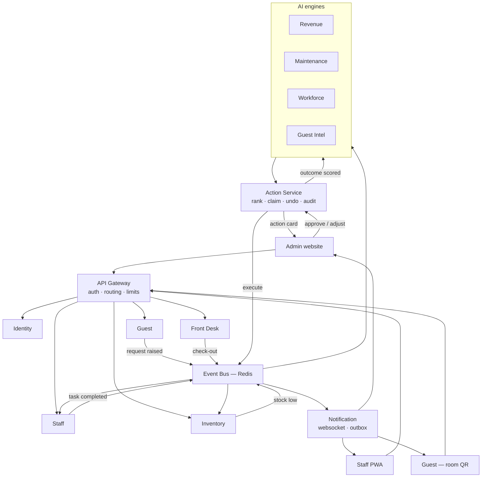

# Vesper

**Smart Resort 360 — one operating layer for a large hotel.**

Vesper connects the three people who never share a screen: the **guest** in the room,
the **staff member** on the floor, and the **owner** in the office. A guest scans the QR
code on their nightstand, a housekeeper's phone buzzes, stock drops by one, the AI
notices bread is running low, and the owner approves a purchase order — one flow, no
phone calls in between.

Demo property: **JW Marriott Mumbai, Juhu.**

> **Disclaimer** — Vesper is an academic project. It is not affiliated with, endorsed by,
> or connected to Marriott International or any of its properties. Every guest, booking,
> staff member, sensor reading, invoice and revenue figure in this repository is
> simulated demo data.

**Stack:** Next.js 15 · React 19 · TypeScript · FastAPI · PostgreSQL · Redis · Docker
**AI:** Prophet · XGBoost · LightGBM · Isolation Forest · OR-Tools CP-SAT · Sentence-BERT · FAISS · Claude

---

## 1. What Vesper does

| For | They open | They can |
|---|---|---|
| **Guest** | Room QR code — no app, no login | Order room service, request cleaning or towels, report a problem, track status live, rate in one tap, ask the AI concierge |
| **Staff** | Vesper Staff (installable PWA) | Mark attendance, work their task list, move rooms dirty → cleaning → ready, accept guest requests, report a broken item or shortage with a photo |
| **Manager** | Vesper Admin (website) | Approve or adjust AI action cards, watch their department live, chase overdue requests, manage stock, bookings and rosters |
| **Owner / GM** | Same website, owner view | One dashboard for occupancy, revenue, staff, stock and guest sentiment — plus the action queue, what-if simulator, shadow mode and engine accuracy |

The spine of the product is the **action card**: the AI recommends, a human decides, the
system executes, and the outcome is scored back against the engine that suggested it.

---

## 2. System flow

How one guest request travels through the whole system.



### The same flow in words

1. A guest scans the QR on the nightstand of **Room 412**. The token is valid only while
   that room is occupied — no login needed, and nobody outside the hotel can use it.
2. They order two club sandwiches. **Guest service** creates the request and publishes an
   event.
3. **Staff service** turns it into a task, routes it to F&B and starts an SLA timer. The
   kitchen's phone buzzes within seconds.
4. The waiter marks it delivered. **Inventory service** hears the same event and deducts
   the ingredients automatically.
5. Bread crosses its minimum. **Inventory service** raises a purchase suggestion, which
   **Action service** ranks by confidence × impact × urgency and puts in the owner's
   queue.
6. The owner approves it. Action service executes, logs it to the audit trail, and gives
   them a 10-second undo.
7. A week later the outcome is scored back — if the suggestion was good, that engine's
   confidence goes up. Vesper gets better at its own job.
8. Meanwhile the guest saw *Delivered* on their phone and tapped four stars.

Nobody made a phone call.

---

## 3. Architecture

Thirteen independently deployable services behind one gateway. Services never read each
other's tables — they talk over REST through the gateway, or asynchronously over the
event bus.

### Operations

| Service | Owns | Responsibilities |
|---|---|---|
| `api-gateway` | — | Single entry point, JWT validation, routing, rate limiting, WebSocket auth |
| `identity-service` | users, roles | Login, tokens, permission matrix (`rates:approve`, `attendance:mark`, …) |
| `property-service` | property, departments, rooms, assets | Resort profile, room categories, CSV import with dry-run, PMS/BMS connectors |
| `staff-service` | attendance, tasks | Shift check-in/out, task routing, housekeeping room board, live updates |
| `guest-service` | guests, QR, requests | Room QR tokens, service requests, issue reports with photos, ratings |
| `inventory-service` | stock, purchase orders | Stock in/out, minimums, expiry, auto-deduction, reorder triggers |
| `frontdesk-service` | bookings, stays | Check-in/out, room allocation, guest visit history |

### Intelligence

| Service | Owns | Responsibilities |
|---|---|---|
| `action-service` | action cards, audit log | Card ranking, claim lock, approve / adjust / snooze / dismiss, safe undo, shadow mode, feedback loop and learning |
| `revenue-service` | forecasts, rates | Demand forecasting (Prophet + XGBoost + LightGBM), per-date rate execution, competitor set, what-if simulator |
| `maintenance-service` | asset health, work orders | Anomaly detection on BMS sensors, survival-based risk scores, service windows, work orders |
| `workforce-service` | rosters | OR-Tools CP-SAT auto-roster from attendance and demand, staffing-gap warnings, leave and shift rules |
| `guest-intel-service` | guest DNA, concierge | Sentiment model, preference profiles, at-risk retention offers, RAG concierge (Sentence-BERT + FAISS + Claude) |
| `notification-service` | outbox | WebSocket fan-out, overdue alerts, retrying outbox for mock WhatsApp / SMS / email |

**Why this split:** housekeeping peaks at 11am, the restaurant at 9pm, and the forecasting
engine runs heavy batch jobs whenever it likes. Separating them means one busy service
never slows the rest, and a crash in the AI layer never stops a guest ordering dinner.
It also maps cleanly onto the sprint — Day 6 is one service, Day 7 is two.

---

## 4. Repository layout

```
Vesper/
├── apps/
│   ├── admin-web/        Owner and manager website (Next.js)
│   ├── staff-app/        Staff PWA, installable on phones
│   ├── guest-web/        Public QR page, no login
│   └── marketing-site/   Backlog — after the demo works
│
├── services/             13 FastAPI services (below)
│
├── packages/
│   ├── contracts/        OpenAPI specs + event schemas, shared both sides
│   ├── ui-kit/           Shared components and the Vesper theme
│   └── py-common/        Shared Python: auth, db session, event bus client
│
├── infra/
│   ├── migrations/       Alembic — one schema, one dev database
│   └── postgres/
│
├── data/seed/            JW Marriott Mumbai demo data
├── docs/
├── scripts/              Seeding, day simulator, local bootstrap
├── docker-compose.yml
└── Makefile
```

Every service is the same six modules, so moving between them is muscle memory:

```
services/<name>/
├── app/
│   ├── main.py        FastAPI app and startup
│   ├── api.py         HTTP routes
│   ├── models.py      SQLAlchemy tables
│   ├── schemas.py     Pydantic request/response
│   ├── service.py     business logic
│   ├── events.py      publishers and subscribers
│   └── engines/       ML and optimisation (intelligence services only)
├── tests/
├── Dockerfile
└── requirements.txt
```

Flat modules, not nested packages — a service here owns one bounded context, and a
folder per layer would be five empty directories pretending to be architecture. Split a
module into a package on the day it earns it. `guest-intel-service` also has `app/rag/`
for the concierge's embeddings and vector store.

Migrations are shared rather than per-service: in development all thirteen services
point at one PostgreSQL database with separate schemas, which keeps the demo runnable on
a laptop. Splitting the databases is a deployment change, not a code change.

---

## 5. Demo property profile

**JW Marriott Mumbai, Juhu** — simulated for the demo.

| | |
|---|---|
| Rooms | ~355 across Deluxe, Executive, Club and Suite |
| Departments | Front Office · Housekeeping · F&B · Maintenance · Store · Security |
| Outlets | All-day restaurant, pool bar, spa, banquets |
| Staff in demo | ~180 across six departments and three shifts |
| Data sources | Demo PMS (bookings), demo BMS (sensors), QR service logs, ratings |
| Payments | Mocked — no real payment gateway |

### How a day gets managed

| Time | What happens in Vesper |
|---|---|
| 07:00 | Housekeepers check in by QR or location; the morning room board loads by floor |
| 08:00 | Overnight forecast lands: occupancy up 6% next Saturday → rate card suggestion |
| 09:30 | Guest in 412 orders breakfast by QR; F&B accepts in 40 seconds, SLA timer runs |
| 09:45 | Delivered → stock auto-deducts → bread hits minimum → purchase suggestion queued |
| 11:00 | Check-outs flip rooms to *dirty*; tasks fan out by floor automatically |
| 12:00 | A chiller's vibration trend trips the anomaly detector → repair booked on a quiet day |
| 14:00 | Housekeeper reports a broken AC with a photo; duplicate reports merge into one |
| 15:00 | Workforce engine spots a Saturday evening F&B gap → roster adjustment card |
| 16:00 | A request crosses its SLA; the department manager gets an overdue alert |
| 19:00 | A returning guest's visits are dropping → owner approves a retention offer |
| 20:00 | A guest asks the concierge about spa timings; it answers with sources |
| 22:00 | Owner's dashboard: occupancy, revenue, requests closed, stock alerts, staff hours, engine accuracy |

---

## 6. Sprint plan — 10 days

| Day | Theme | Main outcome |
|---|---|---|
| 1 | Foundation | Setup, Vesper design system, database, login, prototype bug fixes |
| 2 | Roles & demo resort | Permission matrix, admin panel, demo data, PMS/BMS connectors, audit log |
| 3 | Staff app | Attendance, tasks, housekeeping room board, live WebSocket updates |
| 4 | Guest QR & requests | Room QR ordering, SLA routing, staff issue and shortage reports |
| 5 | Inventory & front desk | Stock tracking with auto-deduction, bookings, guest visit tracking |
| 6 | Action queue & revenue | Full card flow with drivers and confidence, forecast and pricing, safe undo |
| 7 | Maintenance & workforce | Risk and sensor screens, work orders, auto roster, staffing gaps |
| 8 | Guests & AI concierge | Guest DNA, real sentiment model, retention offers, RAG concierge chat |
| 9 | Dashboard & system | Owner dashboard, simulator, learning, shadow mode, CSV import, 3D twin |
| 10 | Polish & demo | Mobile testing, day simulator, tests, deployment |

Most of the AI logic already exists in the prototype, so Days 6–8 are mainly
reconnecting, fixing and restyling it against the new schema.

### Prototype feature coverage

Every feature from the HackCelestial repo, and where it lands here:

| Prototype feature | Day | Service | What we do |
|---|---|---|---|
| Demand & revenue engine | 6 | `revenue` | Reconnect to new schema, per-date rates, forecast UI |
| Action queue | 6 | `action` | Full card flow: drivers, confidence, ₹ impact, urgency |
| Approve / adjust / snooze / dismiss | 6 | `action` | Adjust modal, snooze menu, dismiss reasons |
| Undo | 6 | `action` | Safe revert plus countdown toast |
| Predictive maintenance | 7 | `maintenance` | BMS + QR log data, risk gauge, sensor trends |
| Workforce optimizer | 7 | `workforce` | Attendance-driven roster, gap warnings |
| Purchase suggestions | 5–6 | `inventory` → `action` | Driven by real stock levels |
| Guest intelligence & Guest DNA | 8 | `guest-intel` | Real sentiment model, preference chips |
| AI concierge | 8 | `guest-intel` | RAG chat for guests, escalation for staff |
| Notifications outbox | 9 | `notification` | Outbox page with retry |
| Feedback loop / learning | 9 | `action` | Accuracy and confidence per engine |
| Revenue simulator | 9 | `revenue` | Slider what-ifs on live data |
| Cold-start readiness | 9 | `action` | Per-engine readiness banner |
| Shadow mode | 9 | `action` | Global toggle, preview banner across executors |
| CSV data import | 9 | `property` | Upload with dry-run errors |
| 3D resort twin | 9 | `admin-web` | Lazy-loaded, 2D fallback on mobile |
| Roles & audit log | 2 | `identity` + `action` | Full permission matrix, every decision logged |
| Live WebSocket updates | 3 | `notification` | Authenticated live events |
| Known bugs | 1 | — | Per-date rates, safe undo, timezone, sentiment |

---

## 7. How we work

- Daily 15-minute stand-up: done, doing, blocked.
- **Day 1, first task:** backend publishes API contracts to `packages/api-contracts/`
  so the frontend builds against mock data in parallel.
- Every feature is a small PR reviewed by one teammate.
- Every evening: merge to `main`, deploy to staging, demo the day's outcome.
- If a task will slip, cut scope, not quality. Extras go to the backlog.

**Backlog after these 10 days:** marketing website · real PMS/BMS integrations · real
payments · billing folio · restaurant POS · banquets · security gate log · Hindi
support · native apps · multi-property.

---

## 8. Getting started

```bash
git clone <repo-url> && cd Vesper
cp .env.example .env
docker compose up --build
```

| Surface | URL |
|---|---|
| Admin website | http://localhost:3000 |
| Staff app | http://localhost:3001 |
| Guest QR page | http://localhost:3002 |
| API gateway | http://localhost:8000/docs |

---

## 9. Previous work

Vesper is the production rebuild of our HackCelestial 3.0 prototype
([Harsh-bugs4ever/HackCelestial](https://github.com/Harsh-bugs4ever/HackCelestial)),
built for Problem Statement 4 by Team VOID. That prototype proved the AI action-card
idea on a single FastAPI monolith with four engines. Vesper keeps the decision layer and
rebuilds everything around it: real roles and an audit trail, a staff app, guest QR
ordering, live inventory, and service boundaries that can scale past one property.
